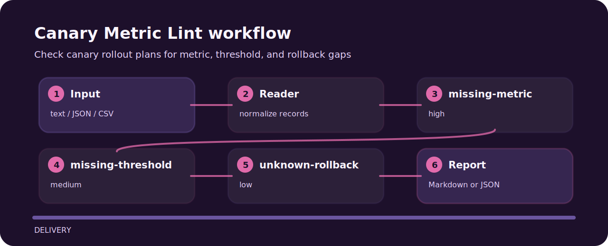

# Canary Metric Lint

Check canary rollout plans for metric, threshold, and rollback gaps.


## Inspection line



## Decision points

- `missing-metric` - canary metric is missing (high); choose a user-impact metric.
- `missing-threshold` - canary threshold is unclear (medium); define stop or rollback threshold.
- `unknown-rollback` - rollback is unclear (low); link rollback command or runbook.

## Code trail

```text
.github/        CI workflow
examples/       sample inputs
src/            package source
tests/          test coverage
```

## Try the fixture

```bash
git clone https://github.com/mertefekurt/canary-metric-lint.git
cd canary-metric-lint
python -m pip install -e ".[dev]"
canary-metric-lint examples/sample.txt
```
